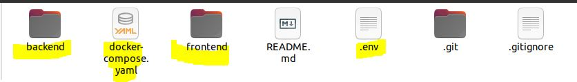
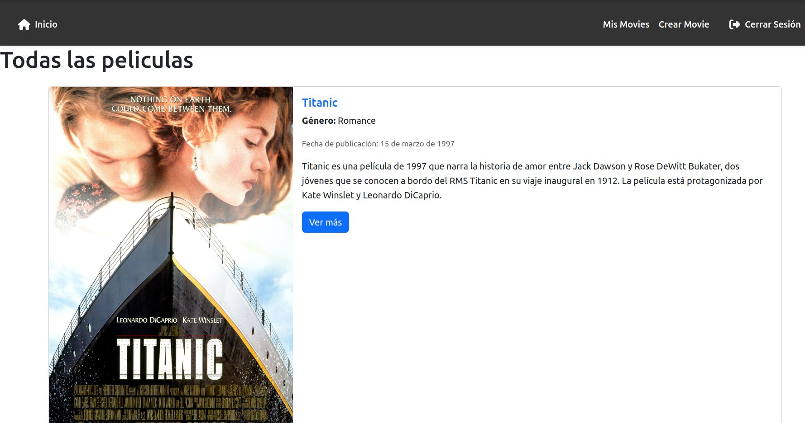
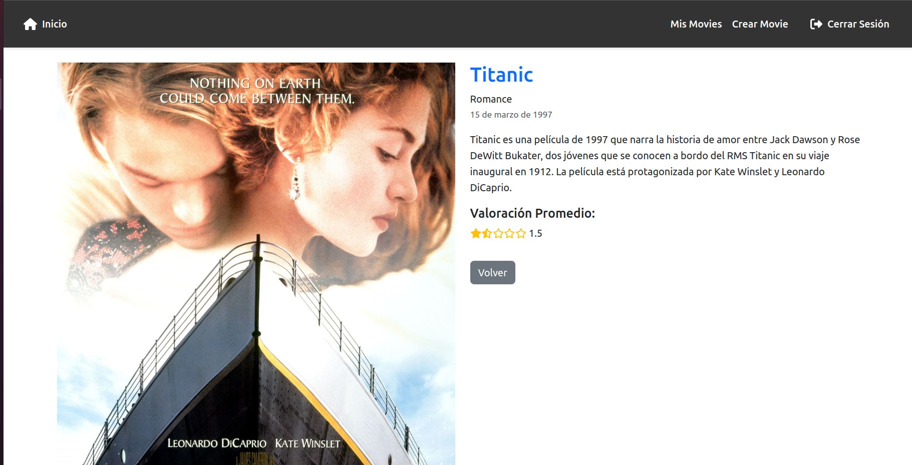
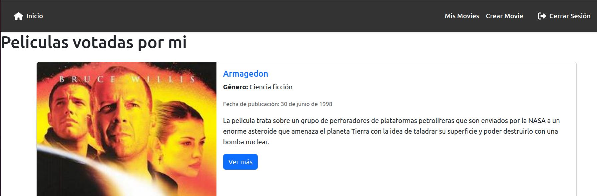

# Frontend con React

## Descripción
Este proyecto es una SPA desarrollada con React, en donde tendremos como entidad principal Movies y Ratings como secundaria.

La aplicacion nos permite crear peliculas y que los usuarios puedan puntuarlas obteniendo el promedio general.

---

## Tecnologías Utilizadas
<p align="center">
  
  
  
  
  
</p>

---
## Tabla de contenidos

- [Frontend con React](#frontend-con-react)
  - [Descripción](#descripción)
  - [Tecnologías Utilizadas](#tecnologías-utilizadas)
  - [Tabla de contenidos](#tabla-de-contenidos)
  - [Desarrollo local con Docker](#desarrollo-local-con-docker)
  - [Prerequisitos](#prerequisitos)
  - [Instalacion](#instalacion)
  - [Ejecutando la aplicacion](#ejecutando-la-aplicacion)
  - [Deteniendo la aplicacion](#deteniendo-la-aplicacion)
  - [Usuario](#usuario)
  - [Imagenes de la aplicacion](#imagenes-de-la-aplicacion)
    - [Home:](#home)
    - [Detalle Movie:](#detalle-movie)
    - [Mis Movies:](#mis-movies)
  - [Link productivo](#link-productivo)
  - [Contribuidores](#contribuidores)
---
## Desarrollo local con Docker
Siguiendo estas instrucciones obtendras una copia del proyecto y correras en tu maquina local utilizando Docker y Docker-Compose para facilitar el desarrollo, de esta manera todos los developers involucrados tendran el mismo entorno.

## Prerequisitos
- [Docker](https://www.docker.com/)
- [Docker Compose](https://docs.docker.com/compose/)
## Instalacion
1. Crear una carpeta llamada moviesblog y dentro de ella clonar el backend y el frontend junto con el archivo .env. y el docker-compose.yml (en la carpeta assets)
2. Clonar el repositorio backend:

   ```bash
   git clone https://github.com/MartinManganiello/backend.git
   ```
3. Clonar el repositorio frontend:

   ```bash
   git clone https://github.com/MartinManganiello/frontend.git
   ```
4. Quedaria de la siguiente manera


## Ejecutando la aplicacion
Para ejecutar la aplicacion utilizando Docker Compose, simplemente ejecute:
```bash
docker-compose up --build
```

Esto hara:

* Construye e inicia el frontend (React) en http://localhost:5173
* Construye e inicia el backend (Node.js + Express) en http://localhost:3000
* Start MongoDB (expuesto internamente al backend)

## Deteniendo la aplicacion
Para detener la aplicacion, ejecuta
```bash
   docker-compose down
```

## Usuario

Para loguearte podes usar el usuario de prueba o crear uno nuevo
```
username: LionelMessi
password: 123
```
---

## Imagenes de la aplicacion

### Home:
Todas las peliculas existentes



### Detalle Movie:
Detalle de la pelicula seleccionada



### Mis Movies:
Peliculas puntuadas por el usuario



---

## Link productivo
link 

---

## Contribuidores

- Olmedo Macarena Yanina
- Manganiello Franco Martin

